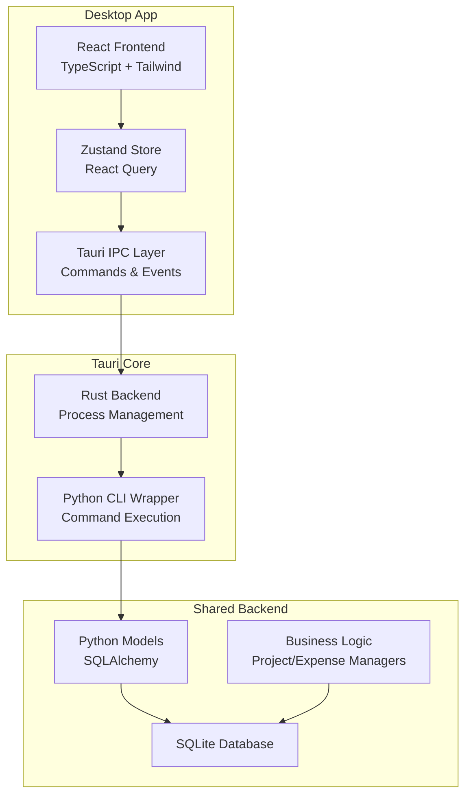

# 🖥️ Desktop Application Plan
## Real Estate Flip Tracker - Desktop Edition

### 🎯 **Strategic Overview**

**Goal**: Create a native desktop application that provides a rich, intuitive interface for managing house flipping projects, offering superior UX for complex data entry and analysis.

**Technology Stack**: 
- **Framework**: Tauri (Rust + Web Frontend)
- **Frontend**: React + TypeScript + Tailwind CSS
- **State Management**: Zustand + React Query
- **Backend Integration**: Python CLI backend via subprocess/IPC
- **Database**: Shared SQLite database with Python backend

### 🏗️ **Architecture Design**



### 📁 **Project Structure**

```
real_estate_tracker/
├── desktop/                    # 🆕 Desktop application
│   ├── src-tauri/             # Rust Tauri backend
│   │   ├── src/
│   │   │   ├── main.rs        # Main Tauri app
│   │   │   ├── commands.rs    # IPC command handlers
│   │   │   ├── python.rs      # Python CLI integration
│   │   │   └── database.rs    # Database path management
│   │   ├── Cargo.toml         # Rust dependencies
│   │   └── tauri.conf.json    # Tauri configuration
│   ├── src/                   # React frontend
│   │   ├── components/        # UI components
│   │   │   ├── layout/        # Layout components
│   │   │   ├── project/       # Project-related components
│   │   │   ├── room/          # Room management
│   │   │   ├── expense/       # Expense tracking
│   │   │   └── budget/        # Budget analysis
│   │   ├── pages/             # Page components
│   │   │   ├── Dashboard.tsx  # Main dashboard
│   │   │   ├── ProjectView.tsx # Project details
│   │   │   └── Settings.tsx   # App settings
│   │   ├── hooks/             # Custom React hooks
│   │   ├── services/          # API service layer
│   │   ├── stores/            # Zustand stores
│   │   ├── types/             # TypeScript types
│   │   └── utils/             # Utility functions
│   ├── package.json           # Frontend dependencies
│   └── index.html             # Entry point
├── backend/                   # ✅ Existing Python backend
└── shared/                    # 🆕 Shared types/schemas
    └── types.ts               # Shared TypeScript definitions
```

### 🔧 **Key Features & UI Components**

#### **1. Dashboard**
- **Project Overview Cards**: Visual grid of all projects with status indicators
- **Quick Stats**: Total budget, active projects, budget utilization
- **Recent Activity**: Latest expenses and project updates
- **Quick Actions**: Create project, add expense buttons

#### **2. Project Management**
- **Project Details Form**: Rich form with validation for project creation/editing
- **Project List**: Sortable/filterable table with advanced search
- **Financial Dashboard**: Charts showing budget vs actual, cost breakdowns
- **Progress Tracking**: Visual progress bars and status indicators

#### **3. Room Management** 
- **Room Grid View**: Visual representation of rooms with floor plans
- **Room Details Panel**: Detailed room information with photo uploads
- **Condition Tracking**: Visual condition ratings with before/after comparisons
- **Room Templates**: Pre-defined room types and standard measurements

#### **4. Expense Tracking**
- **Expense Form**: Smart form with category autocomplete and validation
- **Receipt Scanner**: OCR integration for receipt processing
- **Expense Timeline**: Chronological view of all expenses
- **Bulk Import**: CSV/Excel import functionality

#### **5. Budget Analysis**
- **Budget Dashboard**: Real-time budget tracking with alerts
- **Cost Analytics**: Charts and graphs for cost analysis
- **Forecasting**: Predictive budget projections
- **Export Reports**: PDF/Excel report generation

### 🔌 **Integration Strategy**

#### **Backend Integration**
```typescript
// Tauri Command Interface
import { invoke } from '@tauri-apps/api/tauri'

// Project operations
const createProject = async (data: ProjectData) => {
  return await invoke('create_project', { data })
}

const getProjectList = async () => {
  return await invoke('get_project_list')
}

// Expense operations  
const addExpense = async (projectId: number, expenseData: ExpenseData) => {
  return await invoke('add_expense', { projectId, expenseData })
}
```

#### **Python CLI Wrapper (Rust)**
```rust
use std::process::Command;
use serde_json::Value;

#[tauri::command]
async fn create_project(data: ProjectData) -> Result<Value, String> {
    let output = Command::new("python")
        .args(["-m", "src.cli", "project", "create", &data.name, &data.budget.to_string()])
        .output()
        .map_err(|e| format!("Failed to execute: {}", e))?;
        
    if output.status.success() {
        let stdout = String::from_utf8_lossy(&output.stdout);
        parse_cli_output(&stdout)
    } else {
        Err(format!("CLI error: {}", String::from_utf8_lossy(&output.stderr)))
    }
}
```

### 📊 **State Management**

#### **Zustand Store Structure**
```typescript
interface AppState {
  // Project state
  projects: Project[]
  selectedProject: Project | null
  
  // UI state
  theme: 'light' | 'dark'
  sidebar: boolean
  loading: boolean
  
  // Actions
  setProjects: (projects: Project[]) => void
  selectProject: (id: number) => void
  createProject: (data: ProjectData) => Promise<void>
  updateProject: (id: number, data: Partial<ProjectData>) => Promise<void>
}
```

#### **React Query Integration**
```typescript
// Custom hooks for data fetching
export const useProjects = () => {
  return useQuery({
    queryKey: ['projects'],
    queryFn: async () => await invoke('get_project_list'),
    refetchOnWindowFocus: false
  })
}

export const useProject = (id: number) => {
  return useQuery({
    queryKey: ['project', id],
    queryFn: async () => await invoke('get_project', { id }),
    enabled: !!id
  })
}
```

### 🎨 **UI/UX Design**

#### **Design System**
- **Color Scheme**: Professional blue/gray with accent colors for status
- **Typography**: Modern sans-serif with clear hierarchy
- **Components**: Shadcn/ui component library for consistency
- **Layout**: Responsive design with sidebar navigation
- **Dark Mode**: Full dark mode support

#### **User Experience**
- **Wizard Flows**: Guided project creation and setup
- **Keyboard Shortcuts**: Power user productivity features  
- **Drag & Drop**: Intuitive file uploads and organization
- **Real-time Updates**: Live updates without page refreshes
- **Offline Support**: Basic offline functionality with sync

### 🚀 **Development Phases**

#### **Phase 1: Foundation (Week 1-2)**
- Set up Tauri project structure
- Implement basic IPC with Python backend
- Create core UI components and routing
- Basic project CRUD operations

#### **Phase 2: Core Features (Week 3-4)**  
- Room management interface
- Expense tracking with rich forms
- Basic budget analysis dashboard
- Data visualization components

#### **Phase 3: Advanced Features (Week 5-6)**
- Advanced charts and analytics
- Export functionality
- Settings and preferences
- Error handling and validation

#### **Phase 4: Polish & Testing (Week 7-8)**
- UI/UX refinements
- Performance optimization
- Comprehensive testing
- User acceptance testing

### 🔒 **Security & Performance**

#### **Security**
- **Input Validation**: All user inputs validated on both frontend and backend
- **SQL Injection Protection**: Using existing SQLAlchemy ORM safety
- **File System Access**: Restricted to app data directory
- **Process Isolation**: Sandboxed Python CLI execution

#### **Performance**
- **Bundle Optimization**: Tree-shaking and code splitting
- **Database Optimization**: Indexed queries and efficient data structures
- **Memory Management**: Efficient state management with cleanup
- **Startup Time**: Fast cold start with lazy loading

### 🎯 **Success Metrics**

- **User Experience**: < 3 second app startup time
- **Functionality**: 100% feature parity with CLI
- **Reliability**: < 1% error rate for core operations
- **Performance**: Smooth 60 FPS UI interactions
- **Adoption**: Seamless migration path from CLI

---

This desktop application will provide house flippers with a professional, intuitive tool that makes budget tracking as simple as using a modern web app, while maintaining the robust functionality of our Python backend. 