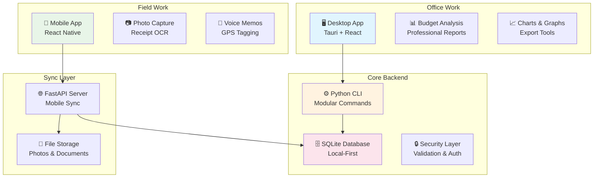

# 👨‍💻 Developer Guide
## Real Estate Flip Tracker - Complete Development Documentation

Welcome to the Real Estate Flip Tracker project! This guide will help you understand the architecture, set up your development environment, and contribute effectively to the codebase.

---

## 🎯 **Project Overview**

### **What We're Building**
A comprehensive multi-platform house flipping budget tracker that helps real estate investors:
- **Track renovation budgets** room-by-room with detailed expense categorization
- **Capture field data** via mobile app (photos, receipts, voice memos)
- **Analyze finances** with professional desktop interface and reporting
- **Sync seamlessly** across all devices with offline-first architecture

### **Target Users**
- **House Flippers**: Individual investors managing 1-5 projects
- **Renovation Teams**: Contractors and project managers
- **Real Estate Investors**: Portfolio management and analysis
- **Property Developers**: Multi-project budget tracking

---

## 🏗️ **Architecture Overview**

### **Multi-Platform Strategy**


### **Technology Stack**

#### **Backend (Python)**
- **Framework**: Python 3.11+ with Typer for CLI
- **Database**: SQLite with SQLAlchemy ORM
- **Security**: bcrypt, AES-256 encryption, JWT tokens
- **Testing**: pytest, comprehensive test suites
- **UI**: Rich library for beautiful console output

#### **Desktop (Tauri)**
- **Core**: Rust + React + TypeScript
- **Styling**: Tailwind CSS + Radix UI components
- **State**: Zustand + React Query
- **Build**: Vite bundler, cross-platform compilation

#### **Mobile (React Native)**
- **Framework**: Expo + React Native
- **State**: Redux Toolkit + RTK Query
- **Features**: Camera, GPS, offline storage
- **Database**: Local SQLite with sync queue

#### **API Server (FastAPI)**
- **Framework**: FastAPI + Python
- **Sync**: Background jobs, conflict resolution
- **Storage**: S3-compatible file storage
- **Auth**: JWT tokens, rate limiting

---

## 📁 **Project Structure**

```
real_estate_tracker/
├── 📚 Documentation
│   ├── README.md              # Project overview
│   ├── ARCHITECTURE.md        # Technical architecture
│   ├── DEVELOPER_GUIDE.md     # This file
│   ├── TROUBLESHOOTING.md     # Common issues & fixes
│   ├── DESKTOP_PLAN.md        # Desktop app roadmap
│   └── MOBILE_STRATEGY.md     # Mobile app strategy
│
├── 🐍 Backend (Python CLI)
│   ├── src/
│   │   ├── cli/               # 🆕 Modular CLI structure
│   │   │   ├── __init__.py    # Main CLI app
│   │   │   ├── utils.py       # Shared utilities
│   │   │   └── commands/      # Command modules
│   │   │       ├── system.py  # init, reset, version, status
│   │   │       ├── project.py # Project CRUD operations
│   │   │       ├── room.py    # Room management
│   │   │       ├── expense.py # Expense tracking
│   │   │       ├── budget.py  # Budget analysis
│   │   │       └── export.py  # Data export
│   │   ├── models.py          # SQLAlchemy data models
│   │   ├── database.py        # Database management
│   │   ├── projects.py        # Business logic
│   │   └── security.py        # Security utilities
│   ├── tests/                 # Unit tests
│   ├── requirements.txt       # Python dependencies
│   └── setup.py              # Package configuration
│
├── 🖥️ Desktop (Tauri App)
│   ├── src-tauri/            # Rust backend
│   │   ├── src/
│   │   │   ├── main.rs       # Main entry point
│   │   │   ├── commands.rs   # IPC command handlers
│   │   │   ├── python.rs     # Python CLI integration
│   │   │   └── database.rs   # App data management
│   │   ├── Cargo.toml        # Rust dependencies
│   │   └── tauri.conf.json   # App configuration
│   ├── src/                  # React frontend (to be implemented)
│   │   ├── components/       # UI components
│   │   ├── pages/           # Page components
│   │   ├── hooks/           # Custom React hooks
│   │   ├── services/        # API service layer
│   │   ├── stores/          # Zustand stores
│   │   └── types/           # TypeScript definitions
│   └── package.json         # Frontend dependencies
│
├── 📱 Mobile (React Native) [Planned]
│   ├── src/
│   │   ├── screens/         # Screen components
│   │   ├── components/      # Reusable components
│   │   ├── services/        # API & sync services
│   │   ├── store/           # Redux state management
│   │   └── utils/           # Helper functions
│   ├── assets/              # Images, icons, etc.
│   └── app.config.js        # Expo configuration
│
├── 🌐 API Server [Planned]
│   ├── routers/             # API route handlers
│   ├── services/            # Business logic
│   ├── models/              # Pydantic models
│   └── main.py              # FastAPI entry point
│
├── 🔄 Shared
│   ├── types.ts             # Common TypeScript types
│   ├── constants.ts         # Shared constants
│   └── validation.ts        # Shared validation schemas
│
└── 🧪 Testing & Tools
    ├── cli_test_workflow.py      # Basic CLI testing
    ├── comprehensive_cli_test.py # Extensive test suite
    ├── validation_suite.py       # Backend validation
    └── .gitignore               # Comprehensive ignore file
```

---

## 🚀 **Quick Start Guide**

### **Prerequisites**
- **Python 3.11+** (with pip and venv)
- **Node.js 18+** (with npm or yarn)
- **Rust 1.70+** (for Tauri desktop app)
- **Git** for version control

### **1. Clone and Setup**
```bash
# Clone the repository
git clone <repository-url>
cd real_estate_tracker

# Set up Python backend
cd backend
python -m venv venv

# Activate virtual environment
# Windows:
venv\Scripts\activate
# macOS/Linux:
source venv/bin/activate

# Install Python dependencies
pip install -r requirements.txt

# Initialize database
python -m src.cli init
```

### **2. Verify Setup**
```bash
# Test CLI functionality
python -m src.cli --help
python -m src.cli project create "Test Project" 50000 single_family sf_class_c

# Run comprehensive tests
cd ..
python comprehensive_cli_test.py

# Check everything is working
python -m src.cli project list
```

### **3. Desktop Development Setup** (Optional)
```bash
# Install Rust (if not already installed)
curl --proto '=https' --tlsv1.2 -sSf https://sh.rustup.rs | sh

# Set up desktop app
cd desktop
npm install

# Install Tauri CLI
npm install -g @tauri-apps/cli

# Start development server
npm run tauri:dev
```

---

## 🔄 **Development Workflow**

### **Git Workflow**
```bash
# Create feature branch
git checkout -b feature/your-feature-name

# Make your changes...
# Test thoroughly...

# Commit with descriptive message
git add .
git commit -m "feat: implement expense bulk import functionality

- Add CSV import validation
- Support for multiple file formats  
- Error handling for malformed data
- Unit tests for import scenarios"

# Push and create pull request
git push origin feature/your-feature-name
```

### **Commit Message Convention**
```bash
# Format: type(scope): brief description
#
# Types:
feat:     New feature
fix:      Bug fix
docs:     Documentation
style:    Formatting, no code change
refactor: Code restructuring
test:     Adding/updating tests
chore:    Maintenance tasks

# Examples:
feat(cli): add expense filtering by date range
fix(desktop): resolve IPC communication timeout
docs(api): update sync endpoint documentation
test(backend): add comprehensive project model tests
```

### **Testing Strategy**
```bash
# Before committing, always run:

# 1. Backend tests
cd backend
python -m pytest tests/

# 2. CLI comprehensive test
cd ..
python comprehensive_cli_test.py

# 3. Validation suite
python validation_suite.py

# 4. Desktop tests (when implemented)
cd desktop
npm test

# 5. Mobile tests (when implemented)
cd mobile
npm test
```

---

## 🏛️ **Architecture Deep Dive**

### **Backend Architecture**
```python
# Modular CLI Structure
# Each command module has single responsibility:

# commands/project.py - Project management
@app.command("create")
def create_project(name: str, budget: float, ...):
    # Input validation
    # Business logic via ProjectManager
    # Database operations
    # Rich output formatting

# Business Logic Layer (projects.py)
class ProjectManager:
    def __init__(self, session: Session):
        self.session = session
    
    def create_project(self, **kwargs) -> Project:
        # Validation
        # Model creation
        # Database persistence
        return project

# Data Layer (models.py)
class Project(Base):
    __tablename__ = "projects"
    # SQLAlchemy model definition
    # Relationships
    # Validation constraints
```

### **Security Architecture**
```python
# Multi-layered security approach:

# 1. Input Validation
class InputValidator:
    @staticmethod
    def validate_project_name(name: str) -> bool:
        # Length, character, SQL injection checks
        
# 2. Path Traversal Prevention  
def sanitize_filename(filename: str) -> str:
    # Remove directory traversal attempts
    # Character whitelist approach
    
# 3. Password Security
class PasswordManager:
    # bcrypt hashing
    # Salt generation
    # Secure comparison
    
# 4. Data Encryption
class DataEncryption:
    # AES-256 encryption for sensitive data
    # Key management
    # Secure storage
```

### **Database Design**
```sql
-- Core entities with proper relationships:

Projects (1) -> (N) Rooms -> (N) Expenses
Projects (1) -> (N) Expenses  -- Direct project expenses
Users (1) -> (N) Projects     -- Multi-user support (future)

-- Key design decisions:
-- 1. Cascading deletes for data integrity
-- 2. Enum types for constrained values
-- 3. Timestamps for audit trails
-- 4. Soft deletes for data recovery
```

---

## 🧪 **Testing Guidelines**

### **Test Categories**

#### **1. Unit Tests** (`backend/tests/`)
```python
# Test individual components
def test_project_creation():
    manager = ProjectManager(session)
    project = manager.create_project(
        name="Test House",
        budget=150000,
        property_type="single_family",
        property_class="sf_class_c"
    )
    assert project.name == "Test House"
    assert project.total_budget == 150000
```

#### **2. Integration Tests** (`comprehensive_cli_test.py`)
```python
# Test CLI commands end-to-end
def test_project_lifecycle(self):
    # Create project
    result = self.run_command("project create 'Test' 50000 single_family sf_class_c")
    
    # Add room
    result = self.run_command("room add 1 'Kitchen' 1 --length 12 --width 10")
    
    # Add expense
    result = self.run_command("expense add 1 'Kitchen' material 2500")
    
    # Verify budget
    result = self.run_command("budget status 1")
```

#### **3. Validation Tests** (`validation_suite.py`)
```python
# Test data integrity and business rules
def test_expense_validation():
    # Test negative costs
    # Test invalid categories
    # Test room relationships
    # Test budget constraints
```

### **Writing Good Tests**
```python
# ✅ Good Test Structure
def test_specific_functionality():
    # Arrange - Set up test data
    project = create_test_project()
    
    # Act - Perform the action
    result = manager.add_expense(project.id, expense_data)
    
    # Assert - Verify the outcome
    assert result.cost == 1500
    assert len(project.expenses) == 1
    
    # Cleanup - Clean up test data
    cleanup_test_data()

# ❌ Avoid These Patterns
def test_everything():  # Too broad
    # Testing multiple unrelated things
    
def test_without_cleanup():  # Leaves test data
    # No cleanup of database state
```

---

## 🎨 **Frontend Development** (Desktop)

### **Component Architecture**
```typescript
// Component hierarchy example:
App
├── Layout
│   ├── Sidebar
│   ├── Header
│   └── MainContent
├── Pages
│   ├── Dashboard
│   ├── ProjectView
│   │   ├── ProjectHeader
│   │   ├── RoomList
│   │   ├── ExpenseTable
│   │   └── BudgetChart
│   └── Settings
└── Modals
    ├── CreateProjectModal
    ├── AddExpenseModal
    └── ConfirmDeleteModal
```

### **State Management**
```typescript
// Zustand store structure
interface AppState {
  // Data state
  projects: Project[]
  selectedProject: Project | null
  expenses: Expense[]
  
  // UI state
  loading: boolean
  error: string | null
  sidebar: boolean
  
  // Actions
  fetchProjects: () => Promise<void>
  createProject: (data: ProjectData) => Promise<void>
  selectProject: (id: number) => void
}

// React Query for server state
const { data: projects, isLoading } = useQuery({
  queryKey: ['projects'],
  queryFn: () => invoke('get_projects')
})
```

### **Tauri Integration**
```typescript
// IPC commands for backend communication
import { invoke } from '@tauri-apps/api/tauri'

// Project operations
export const projectApi = {
  async getAll(): Promise<Project[]> {
    return await invoke('get_projects')
  },
  
  async create(data: ProjectData): Promise<Project> {
    return await invoke('create_project', { data })
  },
  
  async update(id: number, data: Partial<ProjectData>): Promise<Project> {
    return await invoke('update_project', { projectId: id, data })
  }
}
```

---

## 📱 **Mobile Development** (Future)

### **Key Principles**
1. **Offline-First**: App works without internet, syncs when available
2. **Field-Optimized**: Quick expense capture, photo documentation
3. **Battery Efficient**: Minimal background processing
4. **Simple UX**: Touch-friendly, minimal taps required

### **Core Features**
```typescript
// Essential mobile screens:
NavigationStack
├── ProjectList        # Quick project selection
├── ExpenseCapture     # Camera, OCR, quick entry
├── PhotoGallery       # Before/after documentation  
├── VoiceNotes         # Audio memos
└── SyncStatus         # Sync progress, conflicts
```

---

## 🔄 **API Development** (Future)

### **Sync Endpoints**
```python
# FastAPI routes for mobile sync
@app.post("/api/sync/expenses")
async def sync_expenses(changes: List[ExpenseChange]):
    # Process changes
    # Detect conflicts
    # Apply resolution strategy
    # Return results

@app.get("/api/sync/updates/{since}")  
async def get_updates(since: timestamp):
    # Return changes since timestamp
    # Include deletes and conflicts
```

### **Conflict Resolution**
```python
class ConflictResolver:
    def resolve_expense_conflict(
        self, 
        local: Expense, 
        remote: Expense
    ) -> Expense:
        # Last-write-wins for simple fields
        # Sum amounts for duplicates
        # Preserve most complete data
```

---

## 🚀 **Deployment & Distribution**

### **Desktop App**
```bash
# Build for production
cd desktop
npm run tauri:build

# Creates platform-specific installers:
# Windows: .exe, .msi
# macOS: .app, .dmg
# Linux: .AppImage, .deb
```

### **Mobile App**
```bash
# Build for app stores
cd mobile
expo build:android  # Google Play
expo build:ios      # App Store

# Over-the-air updates
expo publish
```

### **API Server**
```bash
# Docker deployment
docker build -t real-estate-api .
docker run -p 8000:8000 real-estate-api

# Cloud deployment (AWS, Google Cloud, etc.)
# Environment variables for secrets
# Database connection strings
# File storage configuration
```

---

## 📈 **Performance Guidelines**

### **Backend Performance**
```python
# Database optimization
class ProjectManager:
    def get_project_with_expenses(self, project_id: int):
        # Use eager loading to avoid N+1 queries
        return session.query(Project)\
            .options(joinedload(Project.expenses))\
            .filter_by(id=project_id)\
            .first()
```

### **Desktop Performance**
```typescript
// React optimization
const ExpenseList = memo(({ expenses }: Props) => {
  // Virtualization for large lists
  // Debounced search
  // Memoized calculations
})

// Tauri optimization
// Minimize IPC calls
// Batch operations
// Cache frequently accessed data
```

### **Mobile Performance**
```typescript
// Mobile-specific optimizations
const ImageCapture = () => {
  // Compress images before storage
  // Background sync queue
  // Battery-aware sync strategy
}
```

---

## 🔍 **Code Review Guidelines**

### **What to Look For**
1. **Security**: Input validation, SQL injection prevention
2. **Performance**: Database queries, memory usage
3. **Testing**: Adequate test coverage, edge cases
4. **Documentation**: Clear comments, updated docs
5. **Architecture**: Follows established patterns

### **Review Checklist**
```markdown
- [ ] All tests pass
- [ ] No security vulnerabilities introduced
- [ ] Performance impact considered
- [ ] Documentation updated
- [ ] Error handling implemented
- [ ] Logging added for debugging
- [ ] Code follows project conventions
- [ ] No hardcoded credentials/secrets
```

---

## 🛠️ **Development Tools**

### **Recommended IDE Setup**
```json
// VS Code extensions
{
  "recommendations": [
    "ms-python.python",
    "rust-lang.rust-analyzer", 
    "bradlc.vscode-tailwindcss",
    "esbenp.prettier-vscode",
    "ms-vscode.vscode-typescript-next"
  ]
}
```

### **Debugging Tools**
```bash
# Backend debugging
python -m pdb src/cli.py project create "Debug Test" 50000

# Database inspection
sqlite3 backend/real_estate_tracker.db
.tables
.schema projects

# Desktop debugging
npm run tauri:dev  # Opens with DevTools

# Mobile debugging
expo start --tunnel  # Remote debugging
```

---

## 📚 **Learning Resources**

### **Python CLI Development**
- [Typer Documentation](https://typer.tiangolo.com/)
- [Rich Library Guide](https://rich.readthedocs.io/)
- [SQLAlchemy Tutorial](https://docs.sqlalchemy.org/en/14/tutorial/)

### **Desktop Development**
- [Tauri Guide](https://tauri.app/v1/guides/)
- [React TypeScript Cheatsheet](https://react-typescript-cheatsheet.netlify.app/)
- [Zustand Documentation](https://github.com/pmndrs/zustand)

### **Mobile Development**
- [React Native Documentation](https://reactnative.dev/docs/getting-started)
- [Expo Documentation](https://docs.expo.dev/)
- [Redux Toolkit Guide](https://redux-toolkit.js.org/introduction/getting-started)

---

## 🤝 **Contributing Guidelines**

### **Before You Start**
1. **Read the architecture docs** to understand the system
2. **Check existing issues** for duplicate work
3. **Discuss major changes** in issues before implementation
4. **Follow the coding standards** established in the project

### **Pull Request Process**
1. **Create descriptive PR title** and description
2. **Reference related issues** with "Fixes #123"
3. **Include screenshots** for UI changes
4. **Ensure all tests pass** locally
5. **Request review** from maintainers

### **Code Standards**
```python
# Python code style
# - Follow PEP 8
# - Use type hints
# - Document functions with docstrings
# - Handle errors gracefully

def create_expense(
    project_id: int,
    room_name: str, 
    cost: float,
    category: ExpenseCategory
) -> Expense:
    """Create a new expense for a project room.
    
    Args:
        project_id: The ID of the project
        room_name: Name of the room for the expense
        cost: Cost amount (must be positive)
        category: Expense category (material/labor)
        
    Returns:
        Created expense instance
        
    Raises:
        ValueError: If cost is negative or room not found
        DatabaseError: If database operation fails
    """
```

---

## 🎯 **Next Steps for New Developers**

### **Week 1: Get Familiar**
- [ ] Set up development environment
- [ ] Run all tests successfully  
- [ ] Create a test project via CLI
- [ ] Explore the codebase structure
- [ ] Read architecture documentation

### **Week 2: Make First Contribution**
- [ ] Pick a "good first issue" from GitHub
- [ ] Implement the feature/fix
- [ ] Write tests for your changes
- [ ] Submit your first pull request
- [ ] Participate in code review

### **Week 3+: Larger Contributions**
- [ ] Choose a major feature area (desktop/mobile/API)
- [ ] Design the implementation approach
- [ ] Break down into smaller tasks
- [ ] Implement incrementally
- [ ] Collaborate with team members

---

## 📞 **Getting Help**

- **Architecture Questions**: Check `ARCHITECTURE.md`
- **Setup Issues**: Check `TROUBLESHOOTING.md`  
- **Development Workflow**: This document
- **Bug Reports**: Create GitHub issue with reproduction steps
- **Feature Requests**: Discuss in GitHub discussions first

---

**🎉 Welcome to the team!** This project has a solid foundation and exciting roadmap. Your contributions will help create an amazing tool for real estate investors and contractors. Let's build something great together! 🚀 