# 📱 Mobile Integration Strategy
## Real Estate Flip Tracker - Mobile Edition

### 🎯 **Strategic Overview**

**Vision**: Create a companion mobile app that allows house flippers to capture expenses, photos, and updates on-site, with seamless sync to the desktop application.

**Mobile-First Use Cases**:
- **On-Site Expense Capture**: Quick expense entry while at the property
- **Photo Documentation**: Before/after photos with GPS tagging
- **Voice Notes**: Audio memos for detailed notes while hands are busy
- **Receipt Scanning**: OCR for instant receipt processing
- **Offline Capability**: Works without internet, syncs when connected
- **Contractor Communication**: Share progress with team members

### 🏗️ **Architecture Strategy**

```mermaid
graph TB
    subgraph "Mobile Apps"
        iOS["📱 iOS App<br/>React Native"]
        Android["📱 Android App<br/>React Native"]
    end
    
    subgraph "Sync Layer"
        API["🌐 REST API<br/>FastAPI + Python"]
        Queue["📬 Sync Queue<br/>Background Jobs"]
        Files["📁 File Storage<br/>MinIO/S3 Compatible"]
    end
    
    subgraph "Shared Backend"
        Desktop["🖥️ Desktop App<br/>Tauri"]
        DB["🗄️ SQLite Database<br/>With Sync Extensions"]
        CLI["⚙️ Python CLI<br/>Modular Commands"]
    end
    
    iOS --> API
    Android --> API
    API --> Queue
    Queue --> DB
    API --> Files
    Desktop --> DB
    CLI --> DB
    
    style iOS fill:#e1f5fe
    style Android fill:#e8f5e8
    style API fill:#fff3e0
    style DB fill:#fce4ec
```



### 📱 **Mobile Technology Stack**

#### **Framework: React Native + Expo**
- **Cross-Platform**: Single codebase for iOS and Android
- **Native Performance**: Access to device features (camera, GPS, storage)
- **Rapid Development**: Hot reloading and OTA updates
- **Rich Ecosystem**: Extensive plugin library

#### **Key Dependencies**
```json
{
  "dependencies": {
    "@expo/vector-icons": "^13.0.0",
    "@react-navigation/native": "^6.1.7",
    "@react-navigation/stack": "^6.3.16",
    "@reduxjs/toolkit": "^1.9.5",
    "react-redux": "^8.1.1",
    "expo-camera": "~13.4.2",
    "expo-image-picker": "~14.3.2",
    "expo-location": "~16.1.0",
    "expo-av": "~13.4.1",
    "expo-file-system": "~15.4.3",
    "expo-sqlite": "~11.3.2",
    "react-native-paper": "^5.10.1",
    "react-hook-form": "^7.45.2",
    "react-native-vision-camera": "^3.2.0",
    "react-native-text-recognition": "^0.2.4"
  }
}
```

### 🔄 **Data Synchronization Strategy**

#### **Hybrid Sync Approach**
1. **Local-First**: All data stored locally in SQLite
2. **Background Sync**: Automatic sync when network available
3. **Conflict Resolution**: Last-write-wins with user notifications
4. **Offline Queue**: Actions queued when offline, executed when online

#### **Sync Architecture**
```typescript
// Mobile Sync Service
class SyncService {
  // Queue local changes for upload
  async queueChange(entity: string, action: 'create' | 'update' | 'delete', data: any) {
    await this.localDB.insert('sync_queue', {
      entity,
      action, 
      data: JSON.stringify(data),
      timestamp: Date.now(),
      synced: false
    });
  }
  
  // Sync with server when online
  async performSync() {
    const pendingChanges = await this.getPendingChanges();
    
    for (const change of pendingChanges) {
      try {
        await this.apiClient.syncChange(change);
        await this.markAsSynced(change.id);
      } catch (error) {
        this.handleSyncError(error, change);
      }
    }
  }
  
  // Download updates from server
  async pullUpdates(lastSync: number) {
    const updates = await this.apiClient.getUpdates(lastSync);
    await this.applyUpdates(updates);
  }
}
```

### 🌐 **Backend API Extension**

#### **New FastAPI Server**
```python
# mobile_api.py - New FastAPI server for mobile sync
from fastapi import FastAPI, Depends, HTTPException
from fastapi.security import HTTPBearer
from sqlalchemy.orm import Session
from .database import get_session
from .models import Project, Room, Expense
from .sync import SyncManager

app = FastAPI(title="Real Estate Tracker Mobile API")
security = HTTPBearer()

@app.post("/sync/projects")
async def sync_projects(
    changes: List[ProjectChange],
    session: Session = Depends(get_session)
):
    """Sync project changes from mobile"""
    sync_manager = SyncManager(session)
    results = []
    
    for change in changes:
        try:
            result = await sync_manager.apply_change(change)
            results.append(result)
        except Exception as e:
            results.append({"error": str(e), "change_id": change.id})
    
    return {"results": results, "timestamp": datetime.utcnow()}

@app.get("/sync/updates/{last_sync}")
async def get_updates(
    last_sync: int,
    session: Session = Depends(get_session)
):
    """Get updates since last sync"""
    updates = await SyncManager(session).get_updates_since(last_sync)
    return {"updates": updates, "timestamp": datetime.utcnow()}
```

### 📁 **Mobile Project Structure**

```
real_estate_tracker/
├── mobile/                      # 🆕 React Native Mobile App
│   ├── src/
│   │   ├── screens/             # Screen components
│   │   │   ├── ProjectScreen.tsx
│   │   │   ├── ExpenseScreen.tsx
│   │   │   ├── CameraScreen.tsx
│   │   │   └── SyncScreen.tsx
│   │   ├── components/          # Reusable components
│   │   │   ├── ExpenseForm.tsx
│   │   │   ├── PhotoCapture.tsx
│   │   │   ├── ReceiptScanner.tsx
│   │   │   └── VoiceRecorder.tsx
│   │   ├── services/            # API and sync services
│   │   │   ├── apiClient.ts
│   │   │   ├── syncService.ts
│   │   │   ├── cameraService.ts
│   │   │   └── storageService.ts
│   │   ├── store/               # Redux state management
│   │   │   ├── projectSlice.ts
│   │   │   ├── expenseSlice.ts
│   │   │   └── syncSlice.ts
│   │   ├── types/               # TypeScript definitions
│   │   └── utils/               # Helper functions
│   ├── assets/                  # Images, icons, etc.
│   ├── package.json
│   ├── app.config.js           # Expo configuration
│   └── metro.config.js         # Metro bundler config
│
├── api/                        # 🆕 Mobile API Server
│   ├── main.py                 # FastAPI entry point
│   ├── routers/                # API route handlers
│   │   ├── sync.py            # Sync endpoints
│   │   ├── projects.py        # Project operations
│   │   └── files.py           # File upload/download
│   ├── services/               # Business logic
│   │   ├── sync_manager.py    # Sync coordination
│   │   └── file_manager.py    # File handling
│   └── models/                 # Pydantic models
│       └── sync.py            # Sync data models
│
└── shared/                     # 🆕 Shared types and utilities
    ├── types.ts               # Common TypeScript types
    ├── constants.ts           # Shared constants
    └── validation.ts          # Shared validation schemas
```

### 📷 **Key Mobile Features**

#### **1. Quick Expense Capture**
```typescript
// ExpenseCapture.tsx - On-site expense entry
const ExpenseCapture = () => {
  const [receipt, setReceipt] = useState<string | null>(null);
  const { addExpense } = useExpenseStore();
  
  const captureReceipt = async () => {
    const result = await ImagePicker.launchCameraAsync({
      mediaTypes: ImagePicker.MediaTypeOptions.Images,
      quality: 0.8,
    });
    
    if (!result.canceled) {
      const ocrText = await extractTextFromImage(result.assets[0].uri);
      const parsedData = parseReceiptData(ocrText);
      
      setReceipt(result.assets[0].uri);
      // Pre-fill form with OCR data
      setExpenseData(parsedData);
    }
  };
  
  return (
    <View style={styles.container}>
      <TouchableOpacity onPress={captureReceipt}>
        <Text>📷 Scan Receipt</Text>
      </TouchableOpacity>
      {/* Expense form with pre-filled data */}
    </View>
  );
};
```

#### **2. Photo Documentation**
```typescript
// PhotoCapture.tsx - Before/after documentation
const PhotoCapture = ({ projectId, roomName }) => {
  const capturePhoto = async (type: 'before' | 'after' | 'progress') => {
    const location = await Location.getCurrentPositionAsync({});
    
    const result = await ImagePicker.launchCameraAsync({
      mediaTypes: ImagePicker.MediaTypeOptions.Images,
      quality: 0.8,
    });
    
    if (!result.canceled) {
      const photoData = {
        uri: result.assets[0].uri,
        type,
        location: {
          latitude: location.coords.latitude,
          longitude: location.coords.longitude,
        },
        timestamp: new Date().toISOString(),
        projectId,
        roomName,
      };
      
      await savePhotoLocally(photoData);
      await queuePhotoSync(photoData);
    }
  };
  
  return (
    <View style={styles.photoGrid}>
      <PhotoButton type="before" onPress={() => capturePhoto('before')} />
      <PhotoButton type="progress" onPress={() => capturePhoto('progress')} />
      <PhotoButton type="after" onPress={() => capturePhoto('after')} />
    </View>
  );
};
```

#### **3. Voice Notes**
```typescript
// VoiceRecorder.tsx - Audio memos while working
const VoiceRecorder = ({ onRecordingComplete }) => {
  const [recording, setRecording] = useState<Audio.Recording>();
  const [permissionResponse, requestPermission] = Audio.usePermissions();
  
  const startRecording = async () => {
    if (permissionResponse.status !== 'granted') {
      await requestPermission();
    }
    
    const { recording } = await Audio.Recording.createAsync(
      Audio.RecordingOptionsPresets.HIGH_QUALITY
    );
    
    setRecording(recording);
  };
  
  const stopRecording = async () => {
    await recording.stopAndUnloadAsync();
    const uri = recording.getURI();
    
    // Convert to text using speech-to-text
    const transcript = await speechToText(uri);
    
    onRecordingComplete({
      audioUri: uri,
      transcript,
      duration: recording.getStatus().durationMillis,
    });
  };
  
  return (
    <TouchableOpacity
      onPress={recording ? stopRecording : startRecording}
      style={[styles.recordButton, recording && styles.recording]}
    >
      <Text>{recording ? '⏹️ Stop' : '🎤 Record Note'}</Text>
    </TouchableOpacity>
  );
};
```

### 🔄 **Offline-First Strategy**

#### **Local Database Schema**
```typescript
// Local SQLite schema for offline operation
const localSchema = {
  projects: `
    CREATE TABLE IF NOT EXISTS projects (
      id INTEGER PRIMARY KEY AUTOINCREMENT,
      server_id INTEGER,
      name TEXT NOT NULL,
      budget REAL NOT NULL,
      created_at TEXT NOT NULL,
      updated_at TEXT NOT NULL,
      synced BOOLEAN DEFAULT 0,
      deleted BOOLEAN DEFAULT 0
    )
  `,
  
  expenses: `
    CREATE TABLE IF NOT EXISTS expenses (
      id INTEGER PRIMARY KEY AUTOINCREMENT,
      server_id INTEGER,
      project_id INTEGER,
      room_name TEXT NOT NULL,
      category TEXT NOT NULL,
      cost REAL NOT NULL,
      notes TEXT,
      photo_uri TEXT,
      audio_uri TEXT,
      location_lat REAL,
      location_lng REAL,
      created_at TEXT NOT NULL,
      synced BOOLEAN DEFAULT 0,
      deleted BOOLEAN DEFAULT 0,
      FOREIGN KEY (project_id) REFERENCES projects (id)
    )
  `,
  
  sync_queue: `
    CREATE TABLE IF NOT EXISTS sync_queue (
      id INTEGER PRIMARY KEY AUTOINCREMENT,
      entity_type TEXT NOT NULL,
      entity_id INTEGER NOT NULL,
      action TEXT NOT NULL,
      data TEXT NOT NULL,
      created_at TEXT NOT NULL,
      attempts INTEGER DEFAULT 0,
      synced BOOLEAN DEFAULT 0
    )
  `
};
```

### 🚀 **Development Phases**

#### **Phase 1: Core Mobile App (Week 1-2)**
- Set up React Native + Expo project
- Implement basic navigation and UI
- Create local SQLite database
- Basic expense entry forms

#### **Phase 2: Camera & Media (Week 3-4)**
- Photo capture and storage
- Receipt OCR integration
- Voice recording and transcription
- GPS tagging for location data

#### **Phase 3: Sync Implementation (Week 5-6)**
- FastAPI server development
- Sync service implementation  
- Conflict resolution logic
- Background sync jobs

#### **Phase 4: Advanced Features (Week 7-8)**
- Offline-first optimization
- Push notifications
- Team sharing features
- Performance optimization

### 📊 **Mobile-Desktop Integration Benefits**

1. **Seamless Workflow**: Capture on mobile, analyze on desktop
2. **Real-Time Updates**: Changes sync across all devices
3. **Rich Documentation**: Photos, audio, and GPS data from the field
4. **Contractor Efficiency**: Quick data entry without interrupting work
5. **Professional Reports**: Desktop generates reports with mobile-captured data

### 🎯 **Success Metrics**

- **Adoption**: 80% of desktop users adopt mobile companion
- **Usage**: Average 10+ expenses captured per project via mobile
- **Sync Reliability**: 99.5% successful sync rate
- **User Experience**: < 5 second expense capture time
- **Photo Documentation**: 50% more projects with before/after photos

---

This mobile strategy creates a powerful **field companion** to the desktop application, enabling house flippers to capture data efficiently on-site while maintaining the robust analysis capabilities of the desktop version. 